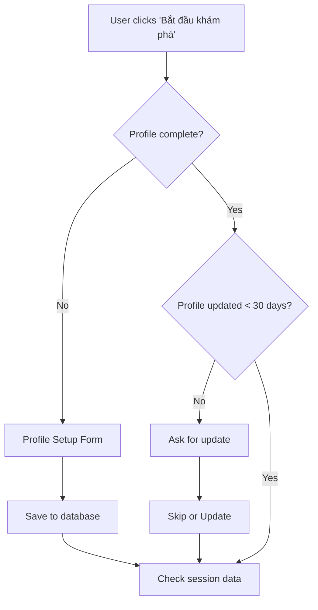
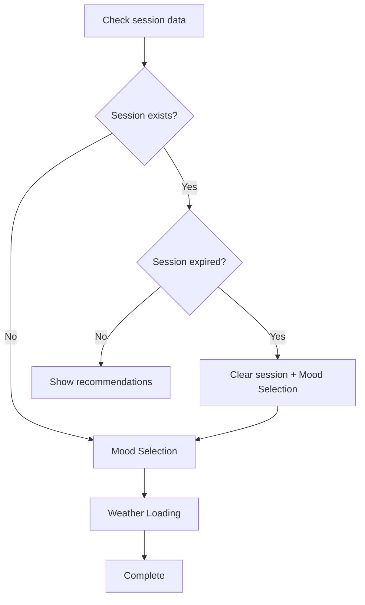

# 🍽️ TastyMind - AI Food Recommendation System

## 📋 Tổng quan

TastyMind là một ứng dụng gợi ý món ăn thông minh sử dụng AI, tích hợp thông tin người dùng, tâm trạng, thời tiết và vị trí để đưa ra gợi ý phù hợp nhất.

## 🏗️ Kiến trúc hệ thống

### Tech Stack
- **Frontend**: Next.js 14, React 18, TypeScript
- **Styling**: Tailwind CSS, Framer Motion
- **Authentication**: NextAuth.js
- **Database**: MongoDB với Mongoose
- **APIs**: OpenWeatherMap, Nominatim (OpenStreetMap)
- **State Management**: React Hooks + SessionStorage

### Cấu trúc thư mục
```
src/
├── app/                    # Next.js App Router
│   ├── api/               # API Routes
│   ├── experience/        # Main experience flow
│   └── ...
├── components/            # React Components
│   ├── ui/               # Base UI components
│   ├── weather/          # Weather components
│   └── experience/       # Experience flow components
├── hooks/                # Custom React Hooks
├── lib/                  # Utilities & configurations
├── models/               # Database models
├── types/                # TypeScript type definitions
├── utils/                # Utility functions
└── context/              # React Context providers
```

## 🔄 User Flow

### 1. Profile Management


### 2. Session Flow


## 🗄️ Database Schema

### User Model
```typescript
interface User {
  name: string;                    // Họ và tên
  email: string;                   // Email (unique)
  dateOfBirth: Date;              // Ngày sinh
  gender: 'male' | 'female' | 'other';
  weight: number;                  // Cân nặng (kg)
  height: number;                  // Chiều cao (cm)
  activityLevel: 'sedentary' | 'light' | 'moderate' | 'active' | 'very_active';
  medicalConditions: string[];     // Bệnh lý
  lastUpdateDate: Date;           // Ngày cập nhật cuối
  providers: string[];            // OAuth providers
}
```

## 💾 Session Management

### SessionStorage Structure
```typescript
interface SessionData {
  mood?: string;                   // Tâm trạng hiện tại
  weather?: WeatherData;           // Thông tin thời tiết
  location?: LocationData;         // Vị trí hiện tại
  formProgress?: number;           // Tiến độ form
  profileComplete?: boolean;       // Trạng thái profile
  lastUpdated?: string;           // Thời gian cập nhật
  expiresAt?: string;             // Thời gian hết hạn
}
```

### TTL (Time To Live)
- **Session TTL**: 30 phút
- **Profile Update**: 30 ngày
- **Auto-cleanup**: Tự động clear khi hết hạn

## 🔔 Notification System

### Types of Notifications
1. **Profile Notifications**
   - Profile update reminder
   - Profile update required
   - Profile saved successfully

2. **Session Notifications**
   - Session expired
   - Session expiring soon
   - Welcome back

3. **Weather Notifications**
   - Weather loaded successfully
   - Weather error
   - Location permission denied

4. **Mood Notifications**
   - Mood selected
   - Recommendation ready

### Notification Service
```typescript
// Usage example
const notificationService = useNotificationService();
notificationService.showProfileUpdateReminder(5); // 5 days left
notificationService.showSessionExpired();
notificationService.showWeatherLoaded('Ho Chi Minh City');
```

## 🌤️ Weather Integration

### OpenWeatherMap API
- **Current Weather**: `/api/weather?lat={lat}&lon={lon}`
- **Weather by Address**: `/api/weather?address={address}`
- **Icon Proxy**: `/api/weather-icon?icon={icon}`

### Weather Data Structure
```typescript
interface WeatherData {
  location: {
    name: string;
    country: string;
    lat: number;
    lon: number;
    timezone: number;
  };
  current: {
    temp_c: number;
    temp_f: number;
    condition: {
      text: string;
      icon: string;
      code: number;
    };
    humidity: number;
    wind_kph: number;
    pressure_mb: number;
    visibility_km: number;
  };
  forecast: ForecastData[];
}
```

## 🎯 Mood System

### Available Moods
```typescript
const moodOptions = [
  { id: 'happy', label: 'Vui vẻ', emoji: '😊' },
  { id: 'sad', label: 'Buồn', emoji: '😢' },
  { id: 'stressed', label: 'Căng thẳng', emoji: '😰' },
  { id: 'excited', label: 'Hào hứng', emoji: '🤩' },
  { id: 'tired', label: 'Mệt mỏi', emoji: '😴' },
  { id: 'hungry', label: 'Đói', emoji: '🤤' },
  { id: 'neutral', label: 'Bình thường', emoji: '😐' },
  { id: 'celebrating', label: 'Ăn mừng', emoji: '🎉' }
];
```

## 🔧 API Endpoints

### User Management
- `GET /api/user` - Lấy thông tin user
- `PUT /api/user` - Cập nhật thông tin user

### Weather & Location
- `GET /api/weather` - Lấy thông tin thời tiết
- `GET /api/geocode` - Geocoding services
- `GET /api/weather-icon` - Proxy weather icons

### Authentication
- `POST /api/auth/register` - Đăng ký
- `POST /api/auth/login` - Đăng nhập
- `GET /api/auth/[...nextauth]` - NextAuth endpoints

## 🎨 UI Components

### Base Components
- `Button` - Button component với variants
- `Card` - Card container
- `Input` - Input field
- `Select` - Dropdown select
- `Label` - Form labels

### Custom Components
- `MoodSelection` - Mood selection interface
- `ProfileSetupForm` - Profile setup/update form
- `WeatherCard` - Weather display
- `NotificationProvider` - Toast notifications

## 🚀 Deployment

### Environment Variables
```env
# Database
MONGODB_URI=mongodb://localhost:27017/tastymind

# Authentication
NEXTAUTH_SECRET=your-secret-key
NEXTAUTH_URL=http://localhost:3000

# Weather API
WEATHER_API_KEY=your-openweathermap-api-key

# OAuth Providers
GOOGLE_CLIENT_ID=your-google-client-id
GOOGLE_CLIENT_SECRET=your-google-client-secret
```

### Build & Deploy
```bash
# Install dependencies
npm install

# Development
npm run dev

# Build for production
npm run build

# Start production server
npm start
```

## 🔮 Future Enhancements

### Phase 1: Core Features ✅
- [x] User authentication
- [x] Profile management
- [x] Weather integration
- [x] Mood selection
- [x] Session management
- [x] Notification system

### Phase 2: AI Integration 🚧
- [ ] Food recommendation algorithm
- [ ] Machine learning models
- [ ] Personalization engine
- [ ] Preference learning

### Phase 3: Advanced Features 📋
- [ ] Restaurant integration
- [ ] Order management
- [ ] Social features
- [ ] Analytics dashboard
- [ ] Mobile app

### Phase 4: Scale & Optimize 📈
- [ ] Performance optimization
- [ ] Caching strategies
- [ ] CDN integration
- [ ] Microservices architecture

## 🛠️ Development Guidelines

### Code Style
- **TypeScript**: Strict mode enabled
- **ESLint**: Airbnb config
- **Prettier**: Code formatting
- **Conventional Commits**: Git commit messages

### Testing Strategy
- **Unit Tests**: Jest + React Testing Library
- **Integration Tests**: API endpoints
- **E2E Tests**: Playwright
- **Performance Tests**: Lighthouse

### Performance Metrics
- **Lighthouse Score**: >90
- **Core Web Vitals**: Pass
- **Bundle Size**: <500KB
- **Load Time**: <3s

## 📊 Analytics & Monitoring

### User Metrics
- Daily/Monthly Active Users
- Session duration
- Feature usage
- Conversion rates

### Technical Metrics
- API response times
- Error rates
- Performance metrics
- User feedback

## 🔒 Security Considerations

### Data Protection
- **Encryption**: HTTPS only
- **Authentication**: JWT tokens
- **Authorization**: Role-based access
- **Data Privacy**: GDPR compliance

### API Security
- **Rate Limiting**: 100 requests/minute
- **Input Validation**: Sanitize all inputs
- **CORS**: Configured properly
- **API Keys**: Secure storage

## 🤝 Contributing

### Development Setup
1. Fork the repository
2. Create feature branch
3. Make changes
4. Add tests
5. Submit pull request

### Code Review Process
1. Automated checks pass
2. Code review by maintainers
3. Test coverage >80%
4. Documentation updated

## 📞 Support & Contact

### Documentation
- [API Documentation](./docs/api.md)
- [Component Library](./docs/components.md)
- [Deployment Guide](./docs/deployment.md)

### Issues & Feedback
- GitHub Issues: [Report bugs](https://github.com/your-repo/issues)
- Feature Requests: [Suggest features](https://github.com/your-repo/discussions)
- Support: support@tastymind.com

---

**TastyMind** - Making food discovery smarter with AI 🍽️✨ 